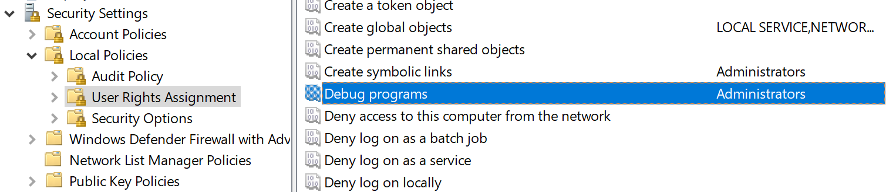

---
layout:
  width: default
  title:
    visible: true
  description:
    visible: false
  tableOfContents:
    visible: true
  outline:
    visible: true
  pagination:
    visible: false
  metadata:
    visible: true
---

# Tmux Logging

Tmux Logging is a tool that will capture all of a terminals acitivity within a Tmux session and saves it to a log file. See [note-taking.md](../../../field-manual/pre-engagement/note-taking.md "mention") for further information.


#### Download & Install

[https://github.com/tmux-plugins/tmux-logging](https://github.com/tmux-plugins/tmux-logging)


## Start Tmux Session

```bash
tmux new -s setup
```

## Basic Setup

First, clone the [Tmux Plugin Manager](https://github.com/tmux-plugins/tpm) repo to our home directory (`/home/kali`).

```bash
git clone https://github.com/tmux-plugins/tpm ~/.tmux/plugins/tpm
```

Next, create a `.tmux.conf` file in the home directory.

```bash
touch .tmux.conf
```

The config file should have the following contents:

```bash
cat .tmux.conf
```

```shell-session
# List of plugins

set -g @plugin 'tmux-plugins/tpm'
set -g @plugin 'tmux-plugins/tmux-sensible'
set -g @plugin 'tmux-plugins/tmux-logging'

# Initialize TMUX plugin manager (keep at bottom)
run '~/.tmux/plugins/tpm/tpm'
```

After creating this config file, we need to execute it in our current session, so the settings in the `.tmux.conf` file take effect. We can do this with the `source` command.

```bash
tmux source ~/.tmux.conf 
```

Next, we can start a new Tmux session.

```bash
tmux new -s setup
```

Once in the session, type `[Ctrl] + [B]` and then hit `[Shift] + [I]` (or `prefix` + `[Shift] + [I]` if you are not using the default prefix key), and the plugin will install (this could take around 5 seconds to complete).

Once the plugin is installed, start logging the current session (or pane) by typing `[Ctrl] + [B]` followed by `[Shift] + [P]` (`prefix` + `[Shift] + [P]`) to begin logging. If all went as planned, the bottom of the window will show that logging is enabled and the output file.

To stop logging, repeat the `prefix` + `[Shift] + [P]` key combo or type `exit` to kill the session. Note that the log file will only be populated once you either stop logging or exit the Tmux session.

Once logging is complete, you can find all commands and output in the associated log file. See the demo below for a short visual on starting and stopping Tmux logging and viewing the results.

## Retroactive Logging

If we forget to enable Tmux logging and are deep into a project, we can perform retroactive logging by typing `[Ctrl] + [B]` and then hitting `[Alt] + [Shift] + [P]` (`prefix` + `[Alt] + [Shift] + [P]`), and the entire pane will be saved.

The amount of saved data depends on the Tmux `history-limit` or the number of lines kept in the Tmux scrollback buffer. If this is left at the default value and we try to perform retroactive logging, we will most likely lose data from earlier in the assessment.&#x20;

To safeguard against this situation, we can add the following lines to the `.tmux.conf` file (adjusting the number of lines as we please):

```bash
set -g history-limit 50000
```

## Screen Capture

Another handy trick is the ability to take a screen capture of the current Tmux window or an individual pane. Let's say we are working with a split window (2 panes), one with `Responder` and one with `ntlmrelayx.py`. If we attempt to copy/paste the output from one pane, we will grab data from the other pane along with it, which will look very messy and require cleanup.

We can avoid this by taking a screen capture as follows: `[Ctrl] + [B]` followed by `[Alt] + [P]` (`prefix` + `[Alt] + [P]`).

Here we can see we're working with two panes. If we try to copy text from one pane, we'll grab text from the other pane, which would make a mess of the output. But, with Tmux logging enabled, we can take a capture of the pane and output it neatly to a file.

<figure><figcaption></figcaption></figure>

## Additional Plugins

* [tmux-sessionist](https://github.com/tmux-plugins/tmux-sessionist) - Gives us the ability to manipulate Tmux sessions from within a session: switching to another session, creating a new named session, killing a session without detaching Tmux, promote the current pane to a new session, and more.
* [tmux-pain-control](https://github.com/tmux-plugins/tmux-pain-control) - A plugin for controlling panes and providing more intuitive key bindings for moving around, resizing, and splitting panes.
* [tmux-resurrect](https://github.com/tmux-plugins/tmux-resurrect) - This extremely handy plugin allows us to restore our Tmux environment after our host restarts. Some features include restoring all sessions, windows, panes, and their order, restoring running programs in a pane, restoring Vim sessions, and more.

Check out the complete [tmux plugins list](https://github.com/tmux-plugins/list) to see if others would fit nicely into your workflow. For more on Tmux, check out this excellent [video](https://www.youtube.com/watch?v=Lqehvpe_djs) by Ippsec and this [cheat sheet](https://mavericknerd.github.io/knowledgebase/ippsec/tmux/) based on the video.
